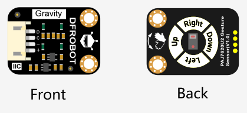

# DFRobot_PAJ7620
The PAJ7620 integrates gesture recognition function with general I2C interface into a single chip forming an image analytic sensor system. It can recognize 9 human hand gesticulations such as moving up, down, left, right, forward, backward, circle-clockwise, circle-counter Key Parameters clockwise, and waving. It also offers built-in proximity detection in sensing approaching or departing object from the sensor. The PAJ7620 is packaged into module form in-built with IR LED and optics lens as a complete sensor solution. <br>
* PAJ7620U2-based gesture recognition sensor, high accuracy, long detecting distance(the distance on the datasheet is 0-15cm, but actually it's up to 20cm during our test).
* We expanded a slow detection mode with 2s recognition cycle. Besides the original 9 gestures, we specifically expanded four gesutres for this mode: slowly move left and right, slowly move up and down, slowly move forward and backward, wave slowly and randomly, which is very suitable for the beginners.  

<br>

<br>

## Product Link（链接到英文商城）
    SKU：PAJ7620挥手传感器
   
## Table of Contents

* [Summary](#summary)
* [Installation](#installation)
* [Methods](#methods)
* [Compatibility](#compatibility)
* [History](#history)
* [Credits](#credits)

## Summary

In this Arduino library, we will show you the basic usage of the PAJ7620 gesture sensor. You can experience the functions below using the built-in examples: 
  1. Read the 9 gestures' function in fast mode. 
  2. Read the function of the 9 basic gestures and 4 expanded gestures in slow mode.
  3. An example of gesture sequence recognition in fast mode, we call it gesture password.

## Installation

To use this library, first download the library file, paste it into the \Arduino\libraries directory, then open the examples folder and run the demo in the folder.

## Methods

```C++
  /**
   * @brief Constructor
   * @param mode Call the function and designate the device's default working mode. 
   */
  DFRobot_PAJ7620U2(TwoWire *pWire=&Wire);

  /**
   * @brief Init function
   * @return Return 0 if the initialization succeeds, otherwise return non-zero. 
   */
  int begin(void);

  /**
   * @brief Set the gesture recognition mode 
   * @param b true Fast detection mode, recognize gestures quickly and return. 
   * @n  false Slow detection mode, the system will do more judgements. 
   * @n  In fast detection mode, the sensor can recognize 9 gestures: move left, right, up, down, forward,
   * @n  backward, clockwise, counter-clockwise, wave.  
   * @n  To detect the combination of these gestures, like wave left, right and left quickly, users need to  
   * @n  design their own algorithms logic. 
   * @n  Since users only use limited gestures, we didn't integrate too much expanded gestures in the library. 
   * @n  If necessary, you can complete the algorithm logic in the ino file by yourself.   
   * @n
   * @n
   * @n  In slow detection mode, the sensor recognize one gesture every 2 seconds, and we have integrated the       
   * @n  expanded gestures inside the library, which is convenient for the beginners to use.  
   * @n  The slow mode can recognize 9  basic gestures and 4 expanded gestures: move left, right, up, down,      
   * @n  forward, backward, clockwise, counter-clockwise, wave, slowly move left and right, slowly move up 
   * @n  and down, slowly move forward and backward, wave slowly and randomly.
   */
  void setGestureHighRate(bool b);

  /**
   * @brief Get the string descritpion corresponding to the gesture number. 
   * @param gesture Gesture number inlcuded in the eGesture_t
   * @return Textual description corresponding to the gesture number:if the gesture input in the gesture table      
   * @n doesn't exist, return null string 
   * @n Normally, it may return "None","Right","Left", "Up", "Down", "Forward", "Backward", "Clockwise",
   * @n "Anti-Clockwise", "Wave", "WaveSlowlyDisorder", "WaveSlowlyLeftRight", "WaveSlowlyUpDown",
   * @n "WaveSlowlyForwardBackward"
   */
  String gestureDescription(eGesture_t gesture);
  /**
   * @brief Get gesture
   * @return The gesture value it may return: eGestureNone  eGestureRight  eGestureLeft  eGestureUp  
   * @n     eGestureDown  eGestureForward  eGestureBackward  eGestureClockwise
   * @n     eGestureWave  eGestureWaveSlowlyDisorder  eGestureWaveSlowlyLeftRight  
   * @n     eGestureWaveSlowlyUpDown  eGestureWaveSlowlyForwardBackward
   */
  eGesture_t getGesture(void);
```

## Compatibility

MCU                | Work Well    | Work Wrong   | Untested    | Remarks
------------------ | :----------: | :----------: | :---------: | -----
Arduino Uno        |      √       |              |             | 
Mega2560        |      √       |              |             | 
Leonardo        |      √       |              |             | 
ESP32           |      √       |              |             | 
micro:bit        |      √       |              |             | 

## History

- Data 2019-7-16
- Version V1.0


## Credits

Written by Alexander(ouki.wang@dfrobot.com), 2019. (Welcome to our [website](https://www.dfrobot.com/))

